# Phase 10: Multi-Agent Workflow Diagrams

**Date:** October 18, 2025  
**Status:** Complete  
**Purpose:** Visual documentation of multi-agent system workflows

---

## 📊 DIAGRAM 1: Complete End-to-End Flow


---

## 📊 DIAGRAM 2: Agent Execution Graph Detail


---

## 📊 DIAGRAM 3: Dependency Resolution


---

## 📊 DIAGRAM 4: Parallel vs Sequential Execution


---

## 📊 DIAGRAM 5: Sequential Execution with Dependencies

```mermaid
sequenceDiagram
    participant User
    participant Coordinator
    participant Graph
    participant BookingAgent
    participant ComplaintAgent
    
    User->>Coordinator: "Show my booking AND file a complaint"
    Coordinator->>Graph: Multi-intent detected
    Graph->>Graph: Analyze dependencies
    Graph->>Graph: complaint depends on booking_status → Sequential
    
    Graph->>BookingAgent: Execute first
    BookingAgent-->>Graph: Booking #12345 info (150ms)
    
    Graph->>Graph: Pass booking context
    
    Graph->>ComplaintAgent: Execute with context
    ComplaintAgent-->>Graph: Complaint #C789 created (100ms)
    
    Graph->>Graph: Merge responses
    Graph->>Graph: Add provenance
    Graph-->>Coordinator: Combined response (250ms total)
    Coordinator-->>User: Formatted response
    
    Note over Graph,ComplaintAgent: Total time = 150ms + 100ms = 250ms
```



---

## 📊 DIAGRAM 6: Agent Routing


---

## 📊 DIAGRAM 7: Provenance Tracking


---

## 📊 DIAGRAM 8: Error Handling Flow


---

## 📊 DIAGRAM 9: Timeout Mechanism


---

## 📊 DIAGRAM 10: State Management


---

## 🎯 KEY INSIGHTS FROM DIAGRAMS

### **1. Parallel Execution Benefits**
- Independent intents execute concurrently
- Total time = max(agent_times), not sum
- Significant performance improvement (1.5-2x faster)

### **2. Dependency Management**
- Automatic detection of intent dependencies
- Sequential execution when needed
- Context passing between dependent agents

### **3. Error Resilience**
- Individual agent failures don't crash system
- Partial results returned when possible
- Comprehensive error tracking in provenance

### **4. Provenance Tracking**
- Every agent contribution tracked
- Execution order recorded
- Performance metrics included
- Success/failure status tracked

### **5. State Management**
- Immutable state updates
- Context-aware execution
- Complete audit trail

---

## 📝 USAGE EXAMPLES

### **Example 1: Independent Intents (Parallel)**
```
User: "Tell me about AC service AND show cancellation policy"

Flow:
1. Intent Classification → 2 intents detected
2. Dependency Analysis → Both independent
3. Parallel Execution → ServiceAgent & PolicyAgent run concurrently
4. Response Merging → Combined response with provenance
5. User receives formatted response

Time: ~200ms (max of both agents)
```

### **Example 2: Dependent Intents (Sequential)**
```
User: "Show my booking AND file a complaint"

Flow:
1. Intent Classification → 2 intents detected
2. Dependency Analysis → complaint depends on booking_status
3. Sequential Execution → BookingAgent first, then ComplaintAgent
4. Context Passing → Booking info passed to ComplaintAgent
5. Response Merging → Combined response with provenance
6. User receives formatted response

Time: ~250ms (sum of both agents)
```

---

## 🔧 TECHNICAL NOTES

### **Parallel Execution**
- Uses `asyncio.gather()` for true concurrency
- Timeout protection (30 seconds default)
- Exception handling with `return_exceptions=True`

### **Sequential Execution**
- Context passed between agents
- Each agent can use previous results
- Maintains execution order

### **Response Merging**
- Intelligent formatting based on agent count
- Provenance tracking for attribution
- Metadata aggregation

### **Error Handling**
- Node-level try/catch
- Agent-level exception handling
- Timeout-level protection
- Fallback to sequential execution

---

**End of Workflow Diagrams**

